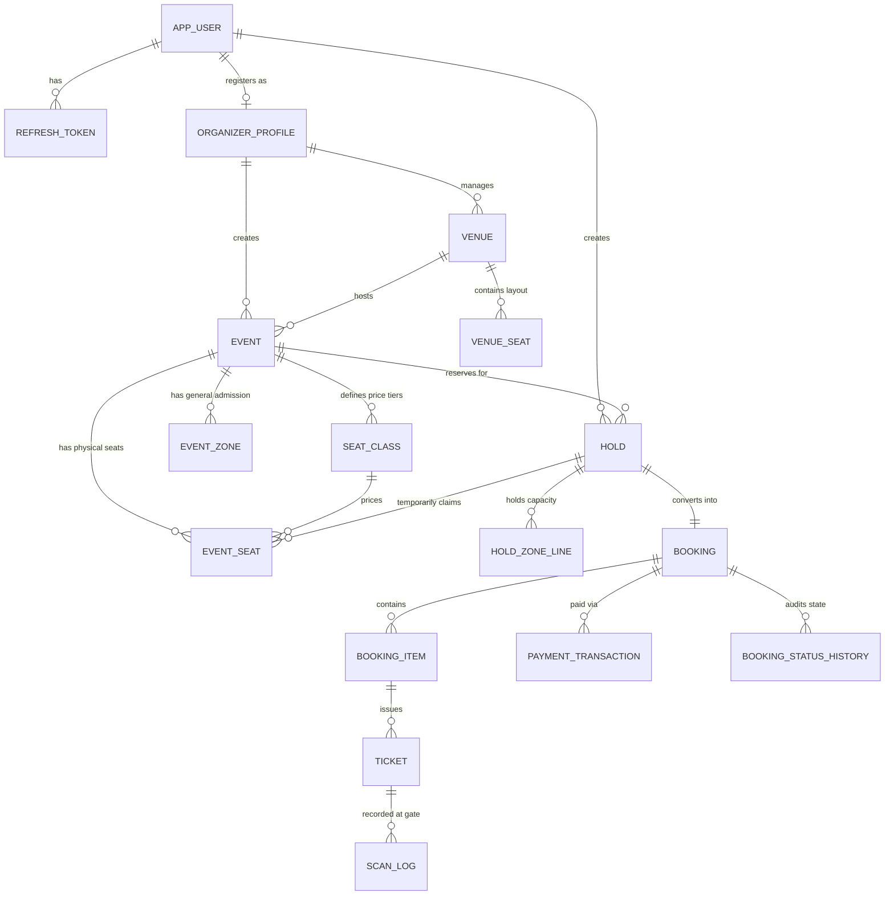

# CamboBook: Comprehensive Project Documentation & Defense Guide

> **Project Name:** CamboBook (Cambodian Event Booking & Ticketing Platform)  
> **Repository:** `Viris168/Event-Booking`  
> **Academic Context:** ETEC Capstone / 100% Scholarship Project Defense  
> **Target Audience:** Project Defense Committee, Technical Evaluators, and Engineering Team  

---

## Table of Contents
1. [Executive Summary & Problem Statement](#1-executive-summary--problem-statement)
2. [System Architecture & Technology Stack](#2-system-architecture--technology-stack)
3. [Database Design & Schema Architecture](#3-database-design--schema-architecture)
4. [The Concurrency Engine: Anti-Overselling Architecture](#4-the-concurrency-engine-anti-overselling-architecture)
5. [Cambodian Payment Gateways & Financial Integrity](#5-cambodian-payment-gateways--financial-integrity)
6. [Ticket Cryptography & Turnstile Gate Check-In](#6-ticket-cryptography--turnstile-gate-check-in)
7. [Finite State Machines (FSM) & Business Workflows](#7-finite-state-machines-fsm--business-workflows)
8. [Role-Based Access Control & User Roles](#8-role-based-access-control--user-roles)
9. [Security Architecture & Defensive Engineering](#9-security-architecture--defensive-engineering)
10. [Telegram Bot & Notification Ecosystem](#10-telegram-bot--notification-ecosystem)
11. [DevOps, Monitoring & Deployment Architecture](#11-devops-monitoring--deployment-architecture)
12. [Defense Q&A Preparation: Anticipated Questions & Strong Answers](#12-defense-qa-preparation-anticipated-questions--strong-answers)
13. [Foolproof 5–7 Minute Live Demo Script](#13-foolproof-57-minute-live-demo-script)

---

## 1. Executive Summary & Problem Statement

### 1.1 The Real-World Problem in Cambodia
Event management and ticketing in Cambodia has historically suffered from:
1. **Informal & Vulnerable Ticketing:** Manual sales via Facebook Messenger, Telegram chats, or physical paper receipts resulting in counterfeiting, duplicate entry, and lost sales.
2. **Double-Booking & Overselling:** High-demand concerts frequently crash manual systems or oversell seats due to lack of strict database concurrency controls.
3. **Absence of Localized Payment Integration:** Global platforms (Eventbrite, Ticketmaster) do not support **Bakong KHQR** or **ABA PayWay**, nor do they handle the dual-currency (USD & KHR) economy of Cambodia properly.
4. **Disjointed Event Typology:** Existing apps cater either strictly to seated cinema halls or open-ground festivals, with no unified platform capable of handling **Mixed-mode events** (e.g., VIP seated rows + General Admission standing floor).

### 1.2 The CamboBook Solution
CamboBook is a production-grade, fullstack event ticketing platform built specifically for the Cambodian ecosystem:
- **Dual-Model Inventory:** Supports `SEATED`, `ZONED` (General Admission), and `MIXED` inventory models in a single cart.
- **Fail-Safe Concurrency:** Prevents overselling down to the last seat using a multi-layer strategy combining temporary holds, database-level check constraints, optimistic locking, and row-level pessimistic locking.
- **Cambodian Payment Infrastructure:** Native integration with National Bank of Cambodia’s **Bakong KHQR** (dynamic QR generation, real-time polling) and **ABA PayWay** (HMAC-SHA512 secured forms and push webhooks), featuring a frozen foreign exchange rate (`USD/KHR`) locked at checkout.
- **Tamper-Proof Tickets:** Cryptographically signed QR codes (`EBT1.<id>.<uuid>.<hmac>`) verifiable in constant time, accompanied by a mobile turnstile check-in web scanner with strict single-use gate locks.
- **Full Operational Lifecycle:** Complete multi-role portal featuring Organizer Venue & Seat-Map Designer, Admin Moderation Queue, Telegram Bot notifications & `/stats` inquiries, and an automated Payout Settlement engine with printable financial invoices.

---

## 2. System Architecture & Technology Stack

```
+---------------------------------------------------------------------------------+
|                                 CLIENT LAYER                                    |
|   React 19 + Vite 8 SPA | React Router 7 | Tailwind CSS v4 | ECharts | Leaflet  |
|               (Customer Web, Organizer Portal, Admin Workspace)                 |
+---------------------------------------------------------------------------------+
                                        │
                                        │ HTTPS / JSON REST API
                                        ▼
+---------------------------------------------------------------------------------+
|                          REVERSE PROXY & GATEWAY                                |
|          Caddy 2 (Automatic Let's Encrypt TLS, Unified Origin Routing)          |
+---------------------------------------------------------------------------------+
                                        │
                                        │ Forwarded Headers (Proxy Protocol)
                                        ▼
+---------------------------------------------------------------------------------+
|                          APPLICATION LAYER (SPRING BOOT)                        |
|                                                                                 |
|  [Security & Auth]    [Catalog & Inventory]   [Hold & Booking Engine]           |
|  - JWT Stateless      - Venues & Seat Maps    - 10-Min Hold TTL                 |
|  - Refresh Rotation   - Seat & Zone Quotas    - BookingStateMachine (FSM)       |
|  - BCrypt + RateLimit - Mixed Event Modes     - Optimistic & Pessimistic Locks  |
|                                                                                 |
|  [Payment Subsystem]  [Ticketing & Gate]      [Integration & Notifications]     |
|  - Bakong KHQR Engine - HMAC-SHA256 Signed QR - Telegram Bot Webhook            |
|  - ABA PayWay Gateway - Offline Filter Check  - Real-time Push Alerts           |
|  - FX Rate Lock (KHR) - Turnstile Scan Log    - Cloudinary Media CDN            |
+---------------------------------------------------------------------------------+
                                        │
                                        │ Connection Pool (HikariCP)
                                        ▼
+---------------------------------------------------------------------------------+
|                             DATA LAYER (POSTGRESQL 16)                          |
|  - Flyway Versioned Migrations (V1 .. V34)                                      |
|  - Declarative CHECK Constraints & Triggers                                     |
|  - Partial Unique Indexes for Idempotency & Concurrency Safety                  |
|  - Relational Integrity (Foreign Keys, ON DELETE SET NULL/CASCADE)              |
+---------------------------------------------------------------------------------+
```

### 2.1 Tech Stack Breakdown & Justifications

| Tier | Technology | Justification for Defense Evaluation |
|---|---|---|
| **Backend** | **Java 21 + Spring Boot 4.1** | Long-Term Support (LTS) modern Java features (records, pattern matching, virtual threads capability), enterprise dependency injection, mature transaction boundary management (`@Transactional`). |
| **Database** | **PostgreSQL 16** | Robust ACID compliance, native JSONB support for webhook payloads, advanced partial unique indexing, check constraints, and battle-tested row-level locking (`FOR UPDATE`). |
| **Migrations** | **Flyway (34 migrations)** | Single source of truth in Git. Guarantees deterministic database environments across local development, CI/CD, and production without error-prone ORM schema auto-generation (`ddl-auto: validate`). |
| **Security** | **Spring Security 6 + Custom JWT** | Deny-by-default architecture, stateless 15-minute access tokens, database-hashed (SHA-256) opaque refresh token rotation, and in-memory brute-force protection. |
| **Frontend** | **React 19 + Vite 8** | Modern component lifecycle, zero layout shifts, lightning-fast compilation, accessible and responsive UI without cookie-cutter AI templates. |
| **State & UI** | **Tailwind CSS v4, ECharts, Leaflet** | Custom theme system, interactive visual analytics for ticket revenue, Leaflet mapping for geocoded venues across Cambodian provinces. |
| **Gate Scanner** | **html5-qrcode** | Real-time in-browser camera scanning supporting rapid turnstile check-ins on low-end mobile devices without dedicated native hardware. |
| **Containerization** | **Docker Compose & Caddy** | Local containerization for team parity; Caddy in production providing seamless SSL certificates and serving SPA and API under a single origin to eliminate CORS attack vectors. |

---

## 3. Database Design & Schema Architecture

The database schema is organized into **10 cohesive functional groups** across 27 primary tables.



### 3.1 Key Schema Innovations

#### 1. Partial Unique Indexes as Hardware-Grade Invariants
Rather than relying solely on application-level validations, critical race conditions are prevented at the database kernel level:
- **Anti-Hold Spamming:** `uq_hold_one_active_per_user_event` on `hold(event_id, user_id) WHERE status = 'ACTIVE'`. Prevents malicious automated scripts from locking out an entire venue by placing hundreds of simultaneous holds.
- **Anti-Double-Booking:** `uq_booking_item_seat` on `booking_item(event_seat_id) WHERE event_seat_id IS NOT NULL`. Makes it mathematically impossible for any two confirmed bookings to claim the same physical seat.
- **Payment Single-Success Invariant:** `uq_payment_txn_one_success_per_booking` on `payment_transaction(booking_id) WHERE status = 'SUCCESS'`. Prevents double charges if two webhooks arrive simultaneously.
- **Sparse Hold Indexing:** `idx_event_seat_hold` on `event_seat(hold_id) WHERE hold_id IS NOT NULL`. Eliminates index bloat, since 95%+ of seats are unheld at any given time.

#### 2. Mixed Inventory Invariant
In `booking_item`:
```sql
CHECK (
  (event_seat_id IS NOT NULL AND event_zone_id IS NULL AND qty = 1) OR
  (event_seat_id IS NULL AND event_zone_id IS NOT NULL AND qty > 0)
)
```
Guarantees that a line item represents either **exactly one assigned seat** or a **positive quantity in a general admission zone**, never both, and never neither.

---

## 4. The Concurrency Engine: Anti-Overselling Architecture

The defining technical highlight of CamboBook is its **safe concurrency handling under peak demand** (e.g., ticket drops for major concerts).

```
   User A (Selects Zone)                   User B (Selects Same Zone)
             │                                         │
             ▼                                         ▼
   POST /api/v1/holds                       POST /api/v1/holds
             │                                         │
    ┌─────────────────┐                       ┌─────────────────┐
    │ Begin @Tx (A)   │                       │ Begin @Tx (B)   │
    └─────────────────┘                       └─────────────────┘
             │                                         │
  SELECT FOR UPDATE (Zone ID: 5)              SELECT FOR UPDATE (Zone ID: 5)
  (Acquires Row Lock immediately)            (Blocks & waits for Lock)
             │                                         ░
  Capacity check:                              ░
  held(18) + sold(30) + req(2) <= 50 (OK)      ░
  Set held_qty = 20                            ░
             │                                         ░
    ┌─────────────────┐                                ░
    │ Commit @Tx (A)  │                                ░
    └─────────────────┘                                ░
             │ (Lock Released) ───────────────────────►│ (Lock Acquired)
             ▼                                         │
      201 Created (Hold)                               Capacity check:
                                                       held(20) + sold(30) + req(2) <= 50
                                                       52 <= 50 (FAIL)
                                                       Rollback & Throw Exception
                                                               │
                                                               ▼
                                                       409 Conflict (Sold Out)
```

### 4.1 Hybrid Concurrency Strategy

| Asset Type | Concurrency Mechanism | Implementation Detail | Why this choice? |
|---|---|---|---|
| **Specific Seats (`EventSeat`)** | **Optimistic Locking (`@Version`)** | An integer `@Version` column incremented on state change (`AVAILABLE` $\to$ `HELD`). | High row count (thousands of seats). Contention is sparse (users rarely click the exact same seat coordinate in the same millisecond). Optimistic locking avoids lock-table overhead. |
| **Zone Counters (`EventZone`)** | **Pessimistic Locking (`SELECT FOR UPDATE`)** | `lockZonesOf()` executes `findAllByIdForUpdate(sortedZoneIds)`. | Hot counter table. 500 users may compete for 50 remaining standing tickets. Optimistic locking would fail 450 transactions due to rollback churn; pessimistic queueing handles bursts smoothly. |
| **Deadlock Prevention** | **Deterministic ID Sorting** | `zoneIds.stream().distinct().sorted().toList()` | By acquiring locks in ascending numeric order, circular wait dependency ($T_1$ waiting on $T_2$ while $T_2$ waits on $T_1$) is mathematically impossible. |

### 4.2 The Hold Lifecycle State Machine

```
              ┌──────────────────────────────────────────────┐
              │                                              │
              ▼                                              │
      [ AVAILABLE SEAT ] ──(createHold)──► [ ACTIVE HOLD ]   │
      [ ZONE CAPACITY  ]                   (TTL: 10 mins)    │
              ▲                                   │          │
              │                       ┌───────────┴──────────┤
              │                       ▼                      ▼
              │            (User cancels / expires)   (Checkout: convertHold)
              │                       │                      │
              │                       ▼                      ▼
              └─────────────── [ RELEASED / EXPIRED ]   [ BOOKING: PENDING ]
                               (Stock Restocked)             │
                                                             ▼
                                                    [ CONFIRMED (PAID) ]
                                                             │
                                                             ▼
                                                    [ SOLD (Terminal) ]
```

1. **Active Hold:** Claims seats and increments `held_qty` for up to 10 minutes (`app.hold.ttl-minutes`).
2. **Checkout Conversion:** Calling `POST /api/v1/bookings` claims the hold. If the hold expired while the user was filling in customer details, `convertHold()` uses `@Transactional(noRollbackFor = HoldExpiredException.class)` to release inventory immediately back into the available pool while returning an HTTP 410.
3. **Background Sweeper (`HoldExpiryJob`):** Runs at fixed intervals (`app.hold.sweeper-interval-ms`) using a lightweight partial index query (`WHERE status = 'ACTIVE' AND expires_at < NOW()`) to release abandoned seats and decrement zone counters.

---

## 5. Cambodian Payment Gateways & Financial Integrity

CamboBook integrates the two preeminent payment systems in Cambodia.

### 5.1 Bakong KHQR (National Bank of Cambodia)
- **Standard:** EMVCo QR Code specification compliant with NBC guidelines.
- **Dual Currency:** Supports both **USD** and **KHR** (`PaymentCurrency` enum stores ISO 4217 numeric codes: 840 for USD, 116 for KHR).
- **Deep Linking:** Generates dynamic Bakong mobile application deep links (`bakong://...`) enabling 1-click payment on customer mobile devices.
- **Reconciliation Engine:** A background daemon (`PaymentPoller` calling `PaymentReconciler.sweep()`) continuously checks open transaction states against the Bakong settlement API and auto-confirms tickets upon receipt.
- **Simulation Mode:** For development and offline defense presentation, a high-fidelity simulation engine enables 1-click payment triggers.

### 5.2 ABA PayWay
- **Checkout Security:** Server generates ABA checkout forms signed with **HMAC-SHA512** over merchant ID, transaction ID, amounts, and item details.
- **Webhook & Instant Push:** Listens for ABA PayWay push callbacks, verified against the merchant hash secret.
- **Stale Close Sweeper:** Closes pending ABA PayWay transactions that exceed the gateway TTL.

### 5.3 Financial Accuracy & Frozen Foreign Exchange (FX)
- **Problem:** Currency exchange rates fluctuate daily. If a ticket priced at $10 is quoted at 40,800 KHR, an exchange rate shift between booking time and payment time would trigger underpayment or overpayment reconciliation bugs.
- **Solution:** CamboBook captures and freezes the exact rate (`fx_rate_khr_per_usd`) and computes `total_khr` at the moment of booking creation. The customer pays the exact frozen KHR amount regardless of subsequent gateway fluctuations.
- **Exact Commission Math:** Platform fees are calculated in **Basis Points** (`fee_bps`, where $1000 = 10.00\%$) rather than floating-point numbers (`double`/`float`), eliminating IEEE 754 binary floating-point rounding discrepancies.

---

## 6. Ticket Cryptography & Turnstile Gate Check-In

A major vulnerability in Cambodian events is screenshot sharing, QR forgery, or gate fraud. CamboBook introduces a cryptographic ticketing engine.

```
┌──────────────────────────────────────────────────────────────────────────────┐
│                            TICKET QR STRUCTURE                               │
│                                                                              │
│    EBT1   .        42        .   ARaBt9WwSFCg1I2WcHYqLA   .   pfBnW1S8Y6h... │
│    ────            ──            ──────────────────────       ────────────── │
│   Version       Ticket ID             122-bit Random              128-bit    │
│   Prefix       (Serial No)             Token (UUID)             HMAC-SHA256  │
└──────────────────────────────────────────────────────────────────────────────┘
```

### 6.1 Cryptographic Defense Layers
1. **Unpredictable Random Token (Database Authority):** 122 bits of cryptographically secure random entropy (`UUIDv4`). Knowing ticket 41 reveals zero information about ticket 42.
2. **HMAC-SHA256 Signature (Gate Filter):** Computed over `EBT1.<ticketId>.<base64UrlToken>` using the server's private `TICKET_SIGNING_SECRET`.
3. **Truncated 16-Byte Signature:** 128-bit truncated HMAC keeps the string under 60 characters. This produces a low-version QR code with larger modules, making it readable by low-cost phone cameras in poor lighting or through cracked screens.
4. **Constant-Time Verification:** Uses `MessageDigest.isEqual()` to prevent cryptographic timing attacks.
5. **Turnstile Concurrency Lock:** When scanned, the gate endpoint executes `SELECT ... FOR UPDATE` on the ticket row before checking `checked_in_at`. If two turnstiles scan copies of the same ticket simultaneously, one succeeds and the second is immediately rejected as `ALREADY_CHECKED_IN`.
6. **Audit Trail (`ScanLog`):** Every scan attempt (successful, duplicated, or tampered) is permanently logged with timestamp, operator user ID, gate name, and status.
7. **Production Startup Guard (`TicketSecretGuard`):** Under any non-dev Spring profile, the API refuses to start if `TICKET_SIGNING_SECRET` remains on the default placeholder string.

---

## 7. Finite State Machines (FSM) & Business Workflows

To prevent illegal states (e.g., an unreviewed event getting published, or a cancelled booking generating tickets), every state change is mediated by strict Finite State Machines.

### 7.1 Event Review Lifecycle (`EventStateMachine`)

```
               ┌───────────┐
               │   DRAFT   │◄─────────────────────────────┐
               └─────┬─────┘                              │
                     │ (SUBMIT)                           │
                     ▼                                    │
           ┌───────────────────┐                          │
           │  PENDING_REVIEW   │──(WITHDRAW)──────────────┤
           └─┬───────┬───────┬─┘                          │
             │       │       │                            │
    (REJECT) │       │       │ (REQUEST_CHANGES)          │
             ▼       │       ▼                            │
      ┌──────────┐   │   ┌───────────────────┐            │
      │ REJECTED │   │   │ CHANGES_REQUESTED │            │
      │(Terminal)│   │   └─────────┬─────────┘            │
      └──────────┘   │             │ (SUBMIT)             │
                     │             ▼                      │
         (APPROVE)   │     [ Back to PENDING ]            │
                     ▼                                    │
               ┌───────────┐                              │
               │ APPROVED  │──(WITHDRAW)──────────────────┘
               └─────┬─────┘  (Prevents approval lock-in)
                     │ (PUBLISH)
                     ▼
               ┌───────────┐
               │ PUBLISHED │◄──────────┐
               └─────┬─────┘           │
                     │ (TAKE_DOWN)     │ (RESTORE)
                     ▼                 │
               ┌────────────┐          │
               │ TAKEN_DOWN ├──────────┘
               └────────────┘
```

### 7.2 Booking Lifecycle (`BookingStateMachine`)

```
                     ┌──────────────────┐
                     │ PENDING_PAYMENT  │◄────────────┐
                     └────────┬─────────┘             │
                              │ (initiate payment)    │
                              ▼                       │
                   ┌──────────────────────┐           │
                   │ AWAITING_CONFIRMATION│           │
                   └──────┬──────────┬────┘           │
                          │          │                │
            (txn success) │          │ (txn failed)   │ (retry payment)
                          ▼          ▼                │
                   ┌───────────┐   ┌────────────────┐ │
                   │ CONFIRMED │   │ PAYMENT_FAILED ├─┘
                   └───────────┘   └───────┬────────┘
                    (Terminal:             │
                   Mints Tickets)          │ (expiry window / user cancel)
                                           ▼
                                 ┌───────────────────┐
                                 │ EXPIRED/CANCELLED │
                                 └───────────────────┘
                                  (Releases Inventory)
```

- **Atomic Audit Trail:** Calling `BookingStateMachine.transition()` automatically appends an immutable record to `booking_status_history`. Direct database status updates are forbidden.

---

## 8. Role-Based Access Control & User Roles

The platform enforces three distinct user roles:

```
┌──────────────────────────────────────────────────────────────────────────────┐
│                               USER ROLES                                     │
├─────────────────┬───────────────────────────────┬────────────────────────────┤
│ CUSTOMER        │ ORGANIZER                     │ PLATFORM_ADMIN             │
├─────────────────┼───────────────────────────────┼────────────────────────────┤
│ - Browse events │ - All Customer capabilities   │ - Moderate events in queue │
│ - Select seats  │ - Manage private venues       │ - Review organizer apps    │
│ - Create holds  │ - Design SVG seat maps        │ - Audit payment txns       │
│ - Pay & checkout│ - Create/edit events          │ - Approve payout transfers │
│ - Ticket wallet │ - Real-time sales analytics   │ - Print financial invoices │
│ - Order history │ - Request payouts             │ - System user management   │
│ - Apply for org │ - Gate turnstile check-in     │ - Public contact inbox     │
│                 │ - Telegram bot `/stats` alerts│                            │
└─────────────────┴───────────────────────────────┴────────────────────────────┘
```

### 8.1 Organizer Onboarding Journey
1. Registered customer navigates to `/become-an-organizer` and submits organization name (English & Khmer), contact details, and credentials.
2. Platform Admin reviews the application under `/admin/applications` and clicks **Approve**.
3. System automatically creates an `organizer_profile` row linked 1-to-1 with the user and upgrades `app_user.role` to `ORGANIZER`.
4. The user's next token refresh reflects the updated role, granting instant access to the `/organizer` workspace without requiring re-registration.

---

## 9. Security Architecture & Defensive Engineering

### 9.1 Deny-by-Default Security Filter Chain
`SecurityConfig.java` strictly enforces that any unlisted route requires authentication:
- Public catalog reads (`/api/v1/events`, `/api/v1/venue`, etc.) are explicitly enumerated rather than wild-carded, preventing private sub-resources from leaking.
- All `/api/v1/admin/**` endpoints require `ROLE_PLATFORM_ADMIN`.
- All `/api/v1/organizer/**` endpoints require `ROLE_ORGANIZER` or `ROLE_PLATFORM_ADMIN`.
- Cross-Site Request Forgery (CSRF) protection is disabled because the API is stateless: credentials reside in the `Authorization: Bearer <jwt>` header rather than ambient browser cookies.

### 9.2 Token Lifecycle & Revocation
- **Access Token:** 15-minute lifespan, signed via HMAC-SHA256. Carries user ID, email/phone, and role claims.
- **Refresh Token:** 14-day lifespan, cryptographically random opaque string. Only its **SHA-256 hash** is persisted in `refresh_token.token_hash`. Even if the database is compromised, active refresh tokens cannot be replayed.
- **Rotation:** Every refresh operation revokes the old token row (`revoked_at = NOW()`) and mints a new pair.

### 9.3 Brute-Force & Denial of Service Protection
- `LoginRateLimiter`: Implements an in-memory sliding window rate limit keyed by IP address and normalized identifier.
- **Key Optimization:** The rate limit is evaluated **before** BCrypt password hashing is invoked. This shields the server's CPU from thread pool starvation caused by malicious login flood scripts.

### 9.4 Google OAuth2 & Mandatory Phone Gating
- Users can authenticate with Google (`POST /api/v1/auth/google`).
- In Cambodia, tickets are distributed and checked against local phone numbers. When a Google user attempts to access checkout, the frontend `PhoneGate` intercepts them and requires a verified Cambodian phone number (`+855` / `0xx`) before proceeding.

---

## 10. Telegram Bot & Notification Ecosystem

Telegram is the predominant communication channel in Cambodia. CamboBook integrates a dedicated Telegram Bot (`@cambobook_bot`):

```
Organizer Dashboard                       Telegram App
        │                                      │
        ├─► Clicks "Connect Telegram"          │
        │   (Mints 10-min temporary token)     │
        │   Deep link: t.me/bot?start=TOKEN ──►│ Opens bot & presses /start
        │                                      │
        │   Telegram Webhook POST              │
        │   /api/v1/telegram/webhook ◄─────────┘
        │   (Validates secret token)
        ▼
Matches token & stores `telegram_chat_id`
        │
        ├───────────────────────────────────────────────────────┐
        ▼                                                       ▼
[Event Approved Trigger]                               [Ticket Sold Trigger]
Sends: "🎉 Your event 'Rock Fest'                      Sends: "🎟 Ticket Sold!"
has been approved and is now ready to publish!"        "$25.00 via Bakong KHQR"
```

### 10.1 Interactive `/stats` Bot Command
Organizers can text `/stats` directly to the bot. The webhook resolves their organizer profile and replies instantly with real-time performance data:
```
📊 Your Events Overview:
--------------------------------
1. Sunset Acoustic Live
   Sold: 142/200 (71%)
   Revenue: $1,420.00 | Avg: $10.00

2. Tech Summit Phnom Penh
   Sold: 450/500 (90%)
   Revenue: $9,000.00 | Avg: $20.00
--------------------------------
Total Settled Revenue: $10,420.00
```

---

## 11. DevOps, Monitoring & Deployment Architecture

### 11.1 Infrastructure Stack
- **Local Dev:** `docker-compose.yml` runs PostgreSQL 16 (port `55432`) and pgAdmin (port `55050`) on non-standard ports to prevent collisions.
- **Production VPS:**
  - Automated provisioning scripts (`provision.sh`, `deploy.sh`).
  - **Caddy Reverse Proxy:** Automatically procures and renews Let’s Encrypt TLS certificates. Proxies `/api/*` to Spring Boot and all other routes to the Vite production static build.
  - **UFW & fail2ban:** Hardened firewall rules exposing only HTTP/HTTPS and SSH.
  - **Observability:** Prometheus scrapes `/actuator/prometheus`, Promtail streams logs, and Grafana renders performance dashboards.

---

## 12. Defense Q&A Preparation: Anticipated Questions & Strong Answers

### Category 1: Concurrency & Database Integrity

#### Q1: What happens if two customers click to buy the very last seat at the exact same millisecond?
> **Strong Defense Answer:**  
> "Double-booking is prevented at two independent layers:
> 1. In the application layer, `createHold` checks `seat.getStatus() == SeatStatus.AVAILABLE`. `EventSeat` uses JPA `@Version` optimistic locking. If two transactions read the seat as available simultaneously, the first to commit increments the version number. The second transaction triggers an `ObjectOptimisticLockingFailureException`, which our service catches and translates into a friendly `409 Conflict: Seat is unavailable`.
> 2. Even if an application bug bypassed this, the database holds a partial unique index: `uq_booking_item_seat ON booking_item(event_seat_id) WHERE event_seat_id IS NOT NULL`. The database engine itself will refuse to insert the second row, maintaining absolute relational integrity."

#### Q2: Why did you use pessimistic locking for general admission zones but optimistic locking for assigned seats?
> **Strong Defense Answer:**  
> "This is a deliberate architectural trade-off based on resource contention:
> - Seats are high in quantity and low in contention—two users rarely pick row G, seat 14 at the exact same instant. Optimistic locking has zero lock-overhead and avoids database blocking.
> - Zones (general admission) represent a shared counter. In a flash sale, hundreds of users compete for the last few tickets. If we used optimistic locking here, 90% of requests would abort due to version collision churn. By using pessimistic row-level locking (`SELECT ... FOR UPDATE`), transactions line up cleanly in a queue. We also sort the zone IDs before locking to guarantee deadlock freedom."

#### Q3: Why use Flyway instead of letting Hibernate auto-generate the tables with `ddl-auto=update`?
> **Strong Defense Answer:**  
> "In an enterprise environment, `ddl-auto=update` is dangerous. It can silently drop columns, cannot handle complex partial indexes or custom triggers, and provides no historical audit trail.
> Flyway enforces a **Schema-First** methodology: every database change is a version-controlled SQL script reviewed in git. Hibernate is strictly configured with `ddl-auto=validate`, meaning the application will refuse to start if entity annotations do not match the database reality."

---

### Category 2: Payments & Financial Integrity

#### Q4: What happens if a network glitch causes Bakong or ABA PayWay to send the payment confirmation webhook twice?
> **Strong Defense Answer:**  
> "We enforce idempotency at both the ingestion and transaction level:
> 1. In `payment_webhook_event`, we enforce a unique constraint on `(provider, provider_event_id)`. A duplicated webhook payload is rejected immediately.
> 2. On the `payment_transaction` table, we have a partial unique index: `uq_payment_txn_one_success_per_booking ON payment_transaction(booking_id) WHERE status = 'SUCCESS'`. Even if two distinct webhook calls slip through application checks simultaneously, the database refuses to record more than one successful payment for any booking."

#### Q5: Cambodia uses both USD and KHR. How do you prevent rounding discrepancies or exchange rate loss?
> **Strong Defense Answer:**  
> "First, we freeze the foreign exchange rate (`fx_rate_khr_per_usd`) at the instant the booking is created. Even if the national bank rate fluctuates an hour later, the customer's KHR bill is immutably locked.
> Second, all monetary calculations are handled in minor units (integer cents for USD, integer Riel for KHR), and platform fees are computed using basis points (`fee_bps`, $1000 = 10\%$) rather than floating-point math, preventing IEEE 754 precision loss."

---

### Category 3: Security & Architecture

#### Q6: Can an attacker forge a ticket QR code or clone someone's ticket by screenshotting it?
> **Strong Defense Answer:**  
> "No:
> 1. An attacker cannot forge a QR code because our QR codes carry an HMAC-SHA256 signature generated with a 256-bit private server secret. Any modified ticket ID or payload is rejected in constant time at the gate without touching the database.
> 2. If a user shares or screenshots a legitimate QR, only the first person to reach the gate is admitted. During check-in, our service executes a pessimistic row lock (`SELECT FOR UPDATE`) on the ticket. The turnstile updates `checked_in_at` atomically. When the second copy is scanned seconds later, the scanner flags it as `ALREADY_CHECKED_IN` and logs the violation in `ScanLog`."

#### Q7: Why use stateless JWT with refresh token rotation instead of traditional server-side sessions?
> **Strong Defense Answer:**  
> "Our architecture separates the React SPA from the Spring Boot API, prepared for horizontal scaling behind a load balancer without sticky sessions.
> Access tokens are short-lived (15 minutes). To prevent token theft vulnerabilities, refresh tokens are opaque, rotated on every usage, and stored in the database **as SHA-256 hashes**. If our database were ever compromised, an attacker could not extract valid refresh tokens to impersonate users."

---

## 13. Foolproof 5–7 Minute Live Demo Script

Follow this structured path during your live presentation:

| Time | Phase | Screen / Action | Speaking Points |
|---|---|---|---|
| **0:00 - 1:00** | **Introduction & Problem** | Home Page (`/`) | "CamboBook is an event ticketing platform built for Cambodia. It addresses the issues of informal ticketing, scalping, and overselling by unifying Seated and General Admission events with native Bakong KHQR and ABA PayWay integration." |
| **1:00 - 2:30** | **Customer Flow: Seated Event** | Event Details $\to$ Interactive Seat Map $\to$ Checkout | "Notice how selecting seats immediately launches a 10-minute hold timer. Behind the scenes, JPA optimistic locking and partial database indexes protect these seats. If another user attempts to select these seats right now, the system prevents a double hold." |
| **2:30 - 3:45** | **Payment & Ticket Issuance** | Payment Page $\to$ Dynamic KHQR $\to$ Simulation Pay | "Here is the dynamic KHQR generated with the frozen KHR exchange rate. Upon payment, the reconciler updates our Booking State Machine, transitions the booking to CONFIRMED, and issues cryptographic HMAC-SHA256 tickets." |
| **3:45 - 4:30** | **Gate Check-In Demonstration** | Gate Scanner (`/organizer/check-in`) | "This is the turnstile check-in app. We scan the ticket: it validates green. If we scan the exact same QR code a second time, the system flags it red as 'Already Admitted' backed by a database row-level lock and audit log." |
| **4:30 - 5:30** | **Organizer & Admin Ecosystem** | Organizer Dashboard $\to$ Telegram / Admin Review | "Organizers can design venue layouts with our SVG editor, link their Telegram account to receive real-time sales alerts and `/stats`, and request commission payouts. Admins manage the platform through a strict event moderation queue." |
| **5:30 - 6:00** | **Conclusion & Wrap-Up** | Architecture Slide / GitHub Repo | "In summary, CamboBook combines enterprise Spring Boot 4, React 19, Flyway database migrations, and cryptographic ticketing to deliver a robust solution tailored for Cambodia's digital economy. Thank you, and we welcome your questions." |

---
*Documentation compiled and verified against codebase schema `V1`–`V34` and backend test suite.*
